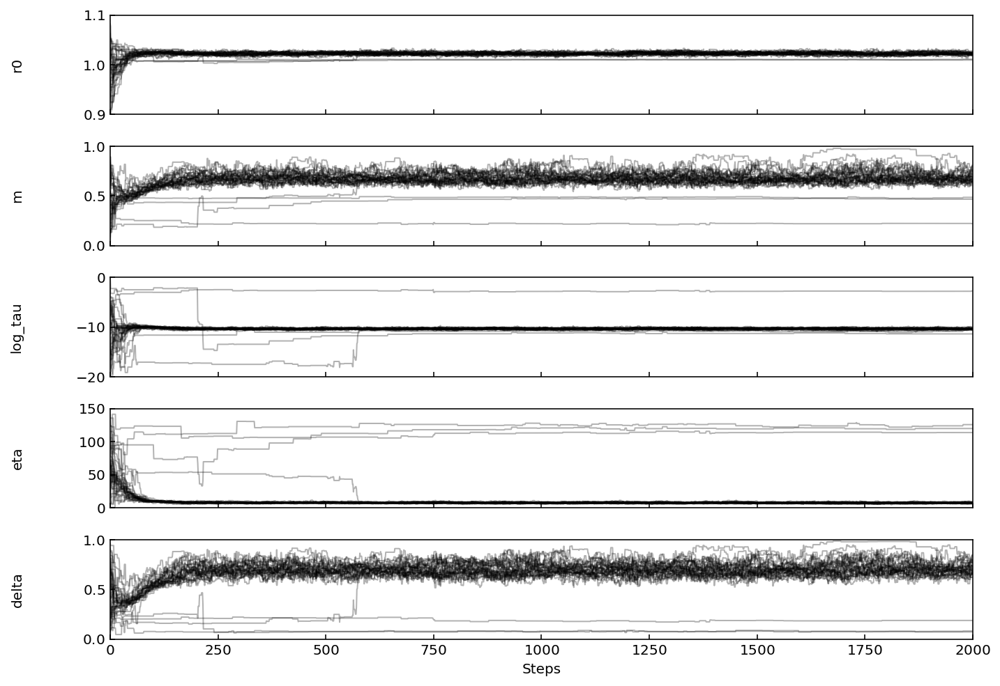
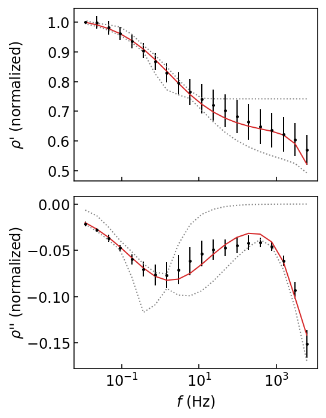
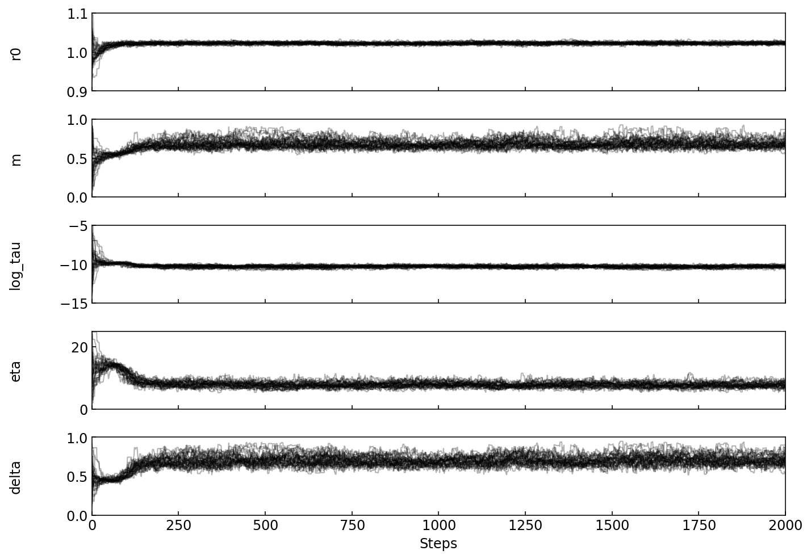
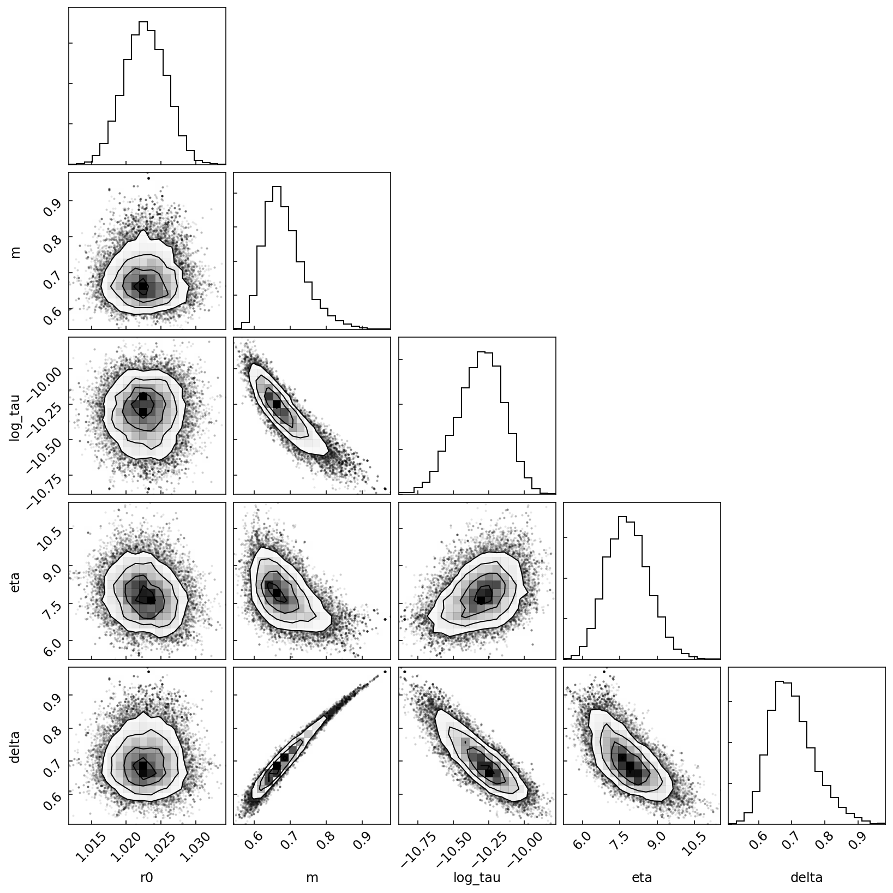

.. _Dias:

The Dias (2000) model
=====================

Introduction
------------
The model proposed by `Dias (1972) <https://agupubs.onlinelibrary.wiley.com/doi/abs/10.1029/JB077i026p04945>`_
describes the petrophysical properties of rocks from measurements of their
electrical polarization in a frequency range typically from
1 mHz to 100 kHz.

We refer to `Dias (2000) <https://library.seg.org/doi/10.1190/1.1444738>`_
for the implementation of the complex resistivity formula in BISIP. This model
predicts that the complex resistivity spectra :math:`\boldsymbol{\rho^*}` of a
polarizable rock sample can be described by

.. math::
  \boldsymbol{\rho^*} = \rho_0 \left[ 1-m\left(1-\frac{1}{1+i\boldsymbol{\omega}\tau'(1+\frac{1}{\mu})} \right) \right],

where :math:`\boldsymbol{\omega}` is the vector of angular measurement frequencies
(:math:`\omega=2\pi f`) and :math:`i` is the imaginary unit. Additionally,
| :math:`\mu = i\omega\tau + \left(i\omega\tau''\right)^{1/2}`,
| :math:`\tau' = (\tau/\delta)(1 - \delta)/(1 - m)` and
| :math:`\tau'' = \tau^2 \eta^2`.

Here, :math:`\rho^*` depends on 5 parameters:

- :math:`\rho_0 \in [0, \infty)`, the direct current resistivity :math:`\rho_0 = \rho (\omega\to 0)`.
- :math:`m \in [0, 1)`, the chargeability :math:`m=(\rho_0 - \rho_\infty)/\rho_0`.
- :math:`\tau \in [0, \infty)`, the relaxation time, related to
  average polarizable particle size.
- :math:`\eta \in [0, 150]`, characteristic of the
  electrochemical environment producing polarization.
- :math:`\delta \in [0, 1)`, the pore length fraction of the electrical double
  layer zone in the material.

In this tutorial we will invert a SIP data with the Dias model to explore the
parameter space of this semi-empirical SIP model. We will also quantify the
relationship between the various parameters.

Exploring the parameter space
-----------------------------

To invert a SIP data file with the Dias model and plot the, start by instantiating a
:class:`Dias2000` object and fall the fit() method to estimate the parameters.

.. code-block:: python

    import os
    import pathlib

    import numpy as np
    import matplotlib.pyplot as plt

    import bisip
    from bisip import Dias2000

    # This will get one of the example data files in the BISIP package
    fp = f'data/SIP-K389172.dat'
    fp = os.path.join(os.path.dirname(bisip.__file__), fp)

    # Define MCMC parameters and Dias model
    nwalkers = 32
    nsteps = 2000
    model = Dias2000(filepath=fp, nwalkers=nwalkers, nsteps=nsteps)
    # Fit model to data
    model.fit()

    #   Out:  100%|██████████| 2000/2000 [00:03<00:00, 625.55it/s]

First let's look at the parameter traces

.. code-block:: python

    model.plot_traces()

    Some walkers get stuck in local minima because the priors are really wide.

Nevertheless, we can see that the median solution of all these chains gives a
satisfying result.

.. code-block:: python

    # Plot the fit by discarding the first 500 steps
    model.plot_fit(discard=500)

    The adjustment is satisfying, but the 95% HPD is very wide because some of
    the walkers were stuck in local minima far from the solution.

A good strategy to reduce the chance that walkers get stuck in local minima
would be to tighten the priors are the values we think give a good result. Here
we will set new boundaries for :math:`\eta` and :math:`\log \tau`.

.. code-block:: python

    # Adjust the boundaries
    model.params.update(eta=[0, 25], log_tau=[-15, -5])
    model.p0 = None  # here we reset the randomly selected initial values

    model.fit()
    model.plot_traces()

.. warning::
    It is important to reset the starting values after changing the boundaries,
    otherwise the chains will start in areas of 0 probability and fail to reach
    a stationary state.

    The stricter priors have allowed all walkers to find a similar stationary state.

With these improved parameter chains the fit quality should be improved.

.. code-block:: python

    # Plot the fit by discarding the first 500 steps
    model.plot_fit(discard=500)

.. figure:: ./figures/dias/dias_fit_after.png
    :width: 50%
    :align: center

    The adjustment is satisfying, and the 95% HPD reasonable if we consider the
    measurement error bars.

We will now visualize the posterior distribution of the Dias model with the `plot_corner` method.

.. code-block:: python

    # Plot the posterior by discarding the first 500 steps
    model.plot_corner(discard=500)

    The corner plot shows interesting correlations between various parameters.

Finally let's look at the optimal parameters and their uncertainties.

.. code-block:: python

    # Print the mean and std of the parameters after discarding burn-in samples
    values = model.get_param_mean(discard=500)
    uncertainties = model.get_param_std(discard=500)

    for n, v, u in zip(model.param_names, values, uncertainties):
        print(f'{n}: {v:.3f} +/- {u:.3f}')

.. rst-class:: center

| :math:`\rho_0 = 1.008 \pm 0.052`
| :math:`m = 0.424 \pm 0.218`
| :math:`\tau = -9.038 \pm 6.046`
| :math:`\eta = 84.133 \pm 47.866`
| :math:`\delta = 0.480 \pm 0.263`

The relatively large error bars on the data have correctly been propagated
in the inversion process, and we observe that several parameters are weakly defined.

Conclusion
----------
From this experiment, we conclude that the :math:`\rho_0` parameter is relatively
independent from the others. We also note that :math:`m` and :math:`\tau` are
characterized by a strong correlation coefficient. Most importantly, we find that
this correlation makes the range of 'best' values for these parameters quite large,
indicating that these parameters are not well resolved for this particular data file.

.. todo::
    Automatically detect if parameters were updated and reset initial values.
