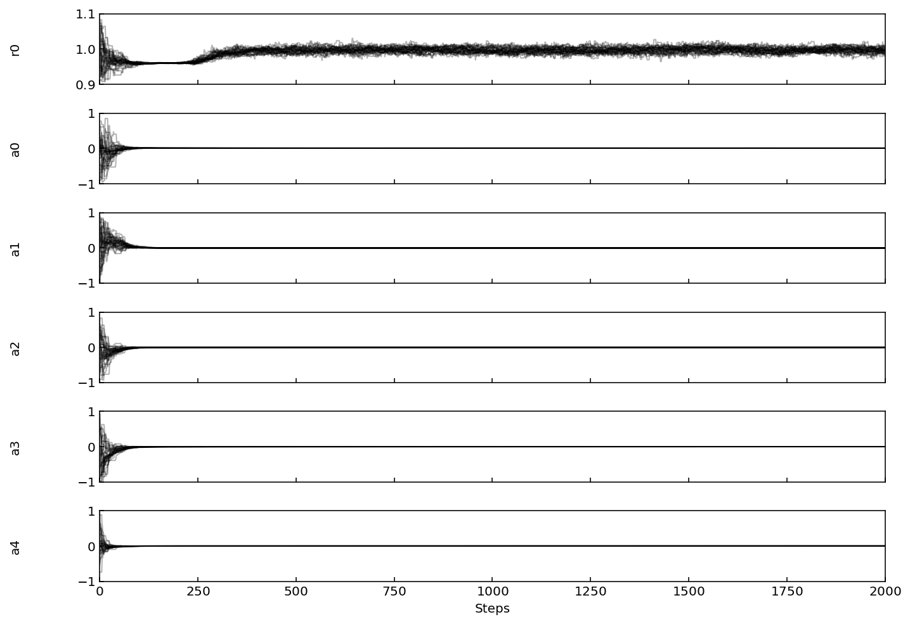
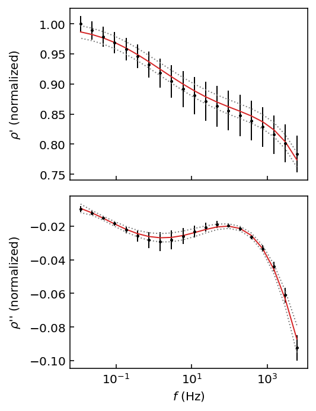
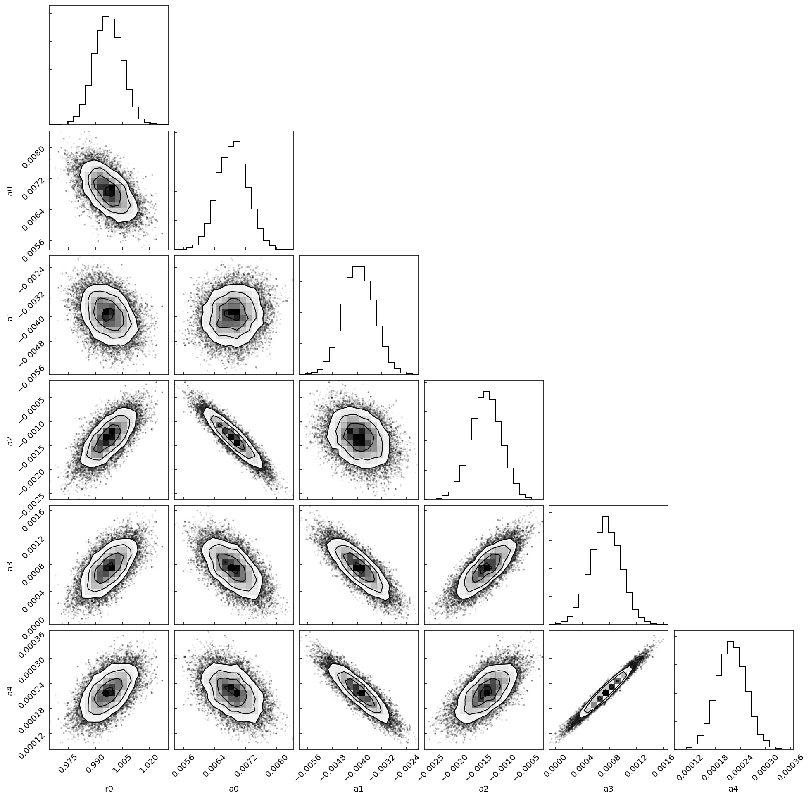

Quickstart
==========

In this first tutorial we load a data file, perform Debye decomposition on it,
visualize the fit quality and posterior distribution and save results to a csv
file.

Running your first inversion
----------------------------

To perform Debye Decomposition of a SIP data file, you would use the following:
First, define a Polynomial Decomposition model with a 4th order approximation
and c-exponent equal to 1 (Debye). Set the simulation to run for 1000 steps
with 32 MCMC walkers exploring the Debye Decomposition parameter space.

.. code-block:: python

  import numpy as np
  from bisip import PolynomialDecomposition

  # Use one of the example data files provided with BISIP
  filepath = '/path/to/bisip/data/SIP-K389175.dat'

  model = PolynomialDecomposition(filepath=filepath,
                                  nwalkers=32,  # number of MCMC walkers
                                  nsteps=2000,  # number of MCMC steps
                                  poly_deg=4,  # 4th order polynomial
                                  c_exp=1.0,  # debye decomposition
                                  )

  # Fit the model to this data file
  model.fit()

  #   Out:  100%|██████████| 1000/1000 [00:01<00:00, 563.92it/s]

Visualizing the parameter traces
--------------------------------

Let's inspect the parameter traces to see how long the burn-in period was.

.. code-block:: python
    # Plot the parameter traces
    model.plot_traces()

    The chains reach a stationary state after at least 500 iterations.

We should therefore keep only the values after the 500th step to estimate the best
values for our parameters.

Extracting values
-----------------

.. code-block:: python

  # Print out the optimal parameters and their uncertainties
  # discarding the first 500 steps (burn-in) and flattening the 32 walkers

  chain = model.get_chain(discard=500, flat=True)

  values = model.get_param_mean(chain=chain)
  uncertainties = model.get_param_std(chain=chain)

  for n, v, u in zip(model.param_names, values, uncertainties):
      print(f'{n}: {v:.5f} +/- {u:.5f}')

  #   Out:  r0: 0.99822 +/- 0.00787
  #         a4: 0.00023 +/- 0.00005
  #         a3: 0.00082 +/- 0.00032
  #         a2: -0.00124 +/- 0.00048
  #         a1: -0.00405 +/- 0.00060
  #         a0: 0.00677 +/- 0.00058

.. note::
    It is important to note that for every inversion scheme the amplitude
    values (and therefore the :code:`r0` parameter) have been normalized.
    You may access this normalization factor with
    :code:`model.data['norm_factor']`. Therefore the real :math:`\rho_0` value
    of the Debye decomposition is :code:`r0*model.data['norm_factor']`.

Plotting fit quality
--------------------

Let's visualize the fit quality by using the 2.5th percentile as the lower
confidence limit, the 50th percentile (median) as the best value and the
97.5th percentile as the upper confidence limit (97.5 - 2.5 = 95% HPD).

.. code-block:: python

    model.plot_fit(chain=chain, p=[2.5, 50, 97.5])

  The dashed lines represent the 95% highest probability density interval. The
  red line represents the median model.

Inspecting the posterior
--------------------––--

Let's now visualize the posterior distribution of all parameters using a
corner plot (from the corner Python package).

.. code-block:: python

    model.plot_corner(chain=chain)

  The chains have indeed reached a normal state.

Saving results to csv files
---------------------------

Finally let's save the best parameters and their statistics as a csv file.

.. code-block:: python

    # Get the lower, median and higher percentiles
    results = model.get_param_percentile(chain=chain, p=[2.5, 50, 97.5])
    # Join the list of parameter names into a comma separated string
    headers = ','.join(model.param_names)
    # Save to csv with numpy
    # The first row is the 2.5th percentile, 2nd the 50th, 3rd the 97.5th.
    # Parameter names will be listed in the csv file header.
    np.savetxt('quickstart_results.csv', results, header=headers,
               delimiter=',', comments='')
